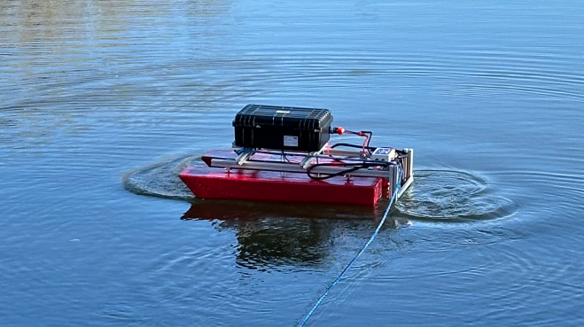

# FOKA USV - Onboard Control System (ROS 2 / RPi 4) 🚤

This repository contains the official source code for the control system running on the onboard computer (**Raspberry Pi 4B**) of the **FOKA** autonomous boat. This project was the core of my Engineering Thesis: *"Steering algorithms of floating robots"*.

*Fig 1. The FOKA robot during autonomous navigation tests on the Oder River.*

## 🌟 About Project FOKA

I am the **founder and project lead** of Project FOKA. This initiative was dedicated to developing an autonomous research platform of the USV (Unmanned Surface Vehicle) class. 

Through my leadership, the project successfully secured **European Union grants** and **Ministerial funding** for research and development. This support allowed us to build a fully functional catamaran-type robot from scratch and implement custom navigation and environmental monitoring systems.

## ⚙️ System Architecture (ROS 2)

The system is built on the **ROS 2** framework. It uses a modular architecture consisting of the following specialized packages:

### 📡 Sensors & Hardware Drivers
* **`sensor_gps`**: Interfaces with the GNSS module for global positioning.
* **`sensor_imu_mag`**: Handles the 9-DoF Inertial Measurement Unit and Magnetometer.
* **`thruster_driver`**: Low-level driver for the BLDC thrusters (PWM control via ESCs).
* **`sensor_depth`**, **`sensor_thermometer`**, **`sensor_ph`**, **`sensor_turbidity`**, **`sensor_tds`**: Drivers for environmental and bathymetric sensors.
* **`sensor_voltage`**, **`sensor_current`**: Power system monitoring.

### 🧠 Core Logic & Data Flow
The system follows a centralized data aggregation pattern:

1.  **Sensors**: Individual `sensor_*` nodes publish raw measurement data.
2.  **`aggregator`**: The central hub that subscribes to all sensor nodes, synchronizing the data streams into a unified state.
3.  **Outbound Flow**: The Aggregator broadcasts the processed data to:
    * **`telemetry`**: Sends real-time data to the Ground Control Station (GCS).
    * **`saver`**: Records all synchronized data into `.csv` files for post-mission analysis.

### 🚢 Autopilot & Control
* **`autopilot`**: A fundamental **Heading-Hold Autopilot**. This controller uses feedback from the IMU/Magnetometer to stabilize the vessel's orientation. It automatically adjusts differential thrust to maintain a constant course.
* **`system_launcher`**: Contains launch files to initialize the entire ROS 2 stack simultaneously.
* **`msg_interfaces`**: Custom ROS 2 message and service definitions used across the system.

## 🔗 Related Repositories
This repository contains the **onboard hardware drivers** and low-level control. For high-level trajectory tracking simulations (LOS/ILOS) and the full text of the engineering thesis (available in both Polish and English), please visit the main project repository:

👉 **[Autonomous USV Navigation & Gazebo Simulation](https://github.com/antpial/thesis_USV_gazebo)**

---
*Developed and Led by: Antoni Piałucha*
